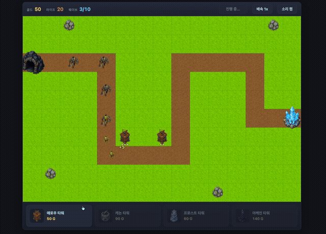

# 🏰 크리스탈 가드 (Crystal Guard)

HTML Canvas로 만든 타워 디펜스 웹 게임. 빌드 도구 없이 바닐라 JS ES 모듈로 작성되었고, 이미지 에셋은 codex-cli(`image_generation`)로, 사운드는 Web Audio API 합성(외부 오디오 파일 0개)으로 제작되었습니다.

## 게임플레이

[](gameplay.mp4)

▶️ **[전체 게임플레이 영상 보기 (mp4, 2분)](gameplay.mp4)** — 클릭하면 GitHub 내장 플레이어로 재생됩니다.

## 실행

```bash
python3 -m http.server 8123
# 브라우저에서 http://127.0.0.1:8123 접속
```

ES 모듈은 `file://`에서 동작하지 않으므로 반드시 로컬 서버로 실행합니다.

## 게임

- **맵**: 15×10 그리드 "수정 골짜기", S자 경로, 킬존 2곳
- **타워 4종**: 애로우(속사 단일딜) / 캐논(스플래시) / 프로스트(슬로우) / 아케인(방어 무시 고단일딜) — 각 3레벨 업그레이드, 판매 환급 70%
- **적 4종 + 보스**: 고블린(물량) / 오크(기준) / 스틸 브루트(중갑) / 와스프 러너(고속) / 스톤 골렘(보스, 슬로우 저항, 누수 시 라이프 -5)
- **승리**: 10웨이브 클리어 / **패배**: 라이프 0 (시작 라이프 20)
- 배속 1x/2x, 음소거 지원

## 코드 구조

```
src/
├── core/      # 게임 루프(고정 타임스텝)·렌더러·입력·이벤트 버스·에셋 로더
├── map/       # 그리드·경로 보간·타일맵
├── entities/  # 타워·적·투사체
├── systems/   # 전투·웨이브·경제
├── ui/        # HUD·상점·배치·패널·화면 (DOM+캔버스 하이브리드)
├── fx/        # 파티클·플로팅 텍스트·플래시 (풀 기반)
├── audio/     # Web Audio 합성 사운드
└── data/      # 밸런스 데이터 (타워/적/웨이브/경제)
scripts/sim.mjs  # 실엔진 봇 기반 밸런스 검증 시뮬레이터 (node scripts/sim.mjs)
```

모듈 간 결합은 이벤트 버스로만 이루어지며, `fx/`·`audio/`는 통째로 제거해도 게임이 동작합니다. 모든 수치는 `src/data/`에 분리되어 코드 수정 없이 밸런스 튜닝이 가능합니다.

---

## 🤖 제작 방식 — 12-에이전트 AI 하네스

이 게임은 사람이 코드를 한 줄도 쓰지 않고, **Claude Code 위에서 12개 전문 AI 에이전트 팀이 협업**해 만들었습니다. 에이전트 정의(`.claude/agents/`)와 스킬(`.claude/skills/`)이 하네스의 전부이며, 설계 문서·QA 리포트 등 제작 기록 원본은 `_workspace/`에 보존되어 있습니다.

### 에이전트 구성 (전원 Claude Fable 모델)

각 에이전트는 8축 트레잇 벡터(주도성·근거성·계획성·사회성·협력성·위험성향·도구성향·반성성)로 성향이 정의되고, 그 성향이 구체적 행동 정책으로 변환되어 있습니다.

| 에이전트 | 역할 | 캐릭터 |
|---|---|---|
| game-director | 기획 총괄 — GDD 작성, 스코프 결정, 최종 승인 | 스코프에 엄격한 결단형 디렉터 |
| system-architect | 모듈 구조·이벤트 계약·데이터 스키마의 단일 출처 | 보수적 계약 중심 설계자 |
| asset-artist | codex-cli 병렬 배치로 이미지 에셋 생성·검수 | 도구를 극한 활용하는 장인 |
| engine-dev | 게임 루프·렌더러·입력·이벤트 버스·에셋 로더 | 과묵한 인프라 장인 |
| map-designer | 그리드·경로 보간·킬존 설계 | 기하학적 사고의 설계자 |
| entity-dev | 타워·적·투사체·전투 파이프라인 | "수치는 데이터로, 동작은 코드로" |
| ui-dev | HUD·상점·배치 프리뷰·화면 전환 | 플레이어의 대변인 |
| fx-dev | 풀 기반 파티클·플로팅·셰이크 | "60fps 깨지는 이펙트는 버그" |
| audio-dev | Web Audio 100% 합성 사운드 | 프로시저럴 오디오 스페셜리스트 |
| wave-balancer | 밸런스 공식·시뮬레이션 검증 | 팀의 수학자 |
| qa-engineer | 경계면 교차 검증 (모듈 완성 직후마다) | 직업적 회의주의자 |
| playtester | Chrome 자동화 실플레이 테스트 | 짓궂은 파괴자 |

### 워크플로우 (하이브리드 오케스트레이션)

```
Phase 1  설계        game-director(GDD) → system-architect(계약 문서) → 디렉터 교차 검토
Phase 2  병렬 제작    Wave A: 에셋·엔진·맵·엔티티·밸런스 (5명 동시)
                     Wave B: 코어 완성 통지 후 UI·FX·오디오 합류 (3명)
                     + qa-engineer가 모듈 완료마다 즉시 경계면 검증 (incremental QA)
Phase 3  통합 검증    engine-dev가 main.js에 전 모듈 배선 → QA 최종 게이트
Phase 4  플레이테스트  playtester가 실브라우저에서 정상+파괴적 플레이
Phase 5  승인·보고    game-director가 승인 기준 22개(AC-01~22) 전수 판정
```

핵심 협업 규칙:

- **계약 우선(contract-first)**: 이벤트 33종의 이름·페이로드, 데이터 스키마, 모듈 소유권을 아키텍처 계약 문서가 단일 기준으로 관리. 변경은 반드시 아키텍트 승인 → 문서 개정(v1.0→v1.2) → 영향 에이전트 통지 순서로만.
- **소유권 격리**: 남의 파일에서 결함을 발견해도 직접 수정 금지 — 재현 절차를 담아 담당자에게 리포트. 병렬 작업 중 파일 충돌 0건의 비결.
- **이벤트 버스 격리**: fx/audio/ui는 이벤트 구독만으로 동작해, 어떤 모듈이 늦거나 빠져도 나머지가 돌아감 — 에셋이 도착하기 전에도 게임은 플레이스홀더로 완주 가능.

### 스킬 (절차 지식)

| 스킬 | 내용 |
|---|---|
| td-orchestrator | 12명 조율 워크플로우 + 부분 재실행 라우팅("밸런스만 다시" → wave-balancer만 재호출) |
| td-code-standards | 고정 타임스텝 루프, 렌더 레이어, 이벤트 계약, 엔티티 인터페이스, 폴백 규약 |
| td-asset-pipeline | codex 병렬 5장 배치, 스타일 통일 프롬프트, 검수·재생성·규격화 절차 |
| td-balance-design | DPS 예산 vs EHP 곡선 모델, 경제 공식, 체감→수치 대응 표 |
| td-playtest-qa | 경계면 교차 검증 체크리스트 + 브라우저 플레이테스트 시나리오 |

### 품질 하이라이트

- **QA 13회차, 미결 결함 0건**: 파일 존재 확인이 아니라 경계면 양쪽 파일을 열어 문자 단위 대조(이벤트 emit↔on diff, 스키마↔소비자, 에셋 키↔실파일)하는 방식으로 통합 버그를 병렬 개발 중에 소거.
- **밸런스 D9-1 사례**: QA의 실엔진 자동 플레이가 밸런서의 수학 모델이 \~2배 낙관적임을 적발(전 전략 패배). 밸런서는 수치만 고치지 않고 **시뮬레이터 자체를 실엔진 봇 기반으로 교체**해 모델-현실 괴리의 재발을 구조적으로 차단. 보정 후 킬존 플레이 잔여 라이프 50%(목표 30~70% 정중앙).
- **에셋 파이프라인**: codex-cli 병렬 배치(5장 동시)로 18키 전량 1회 생성 성공, 스타일 일관성 전수 검수 통과.
